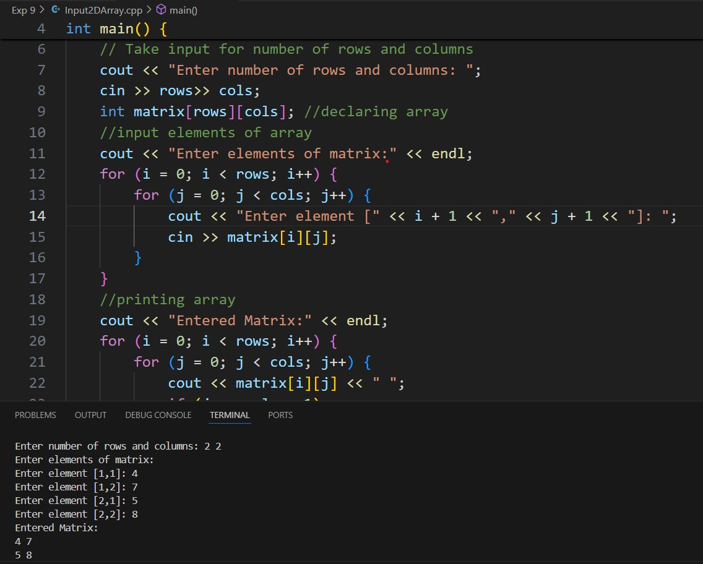
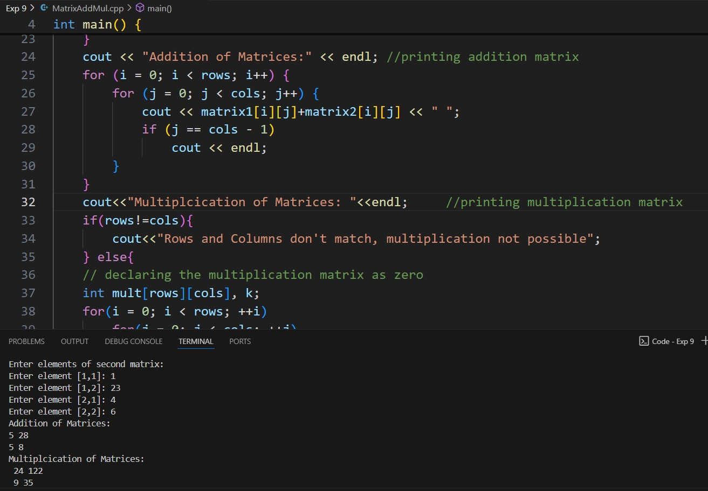
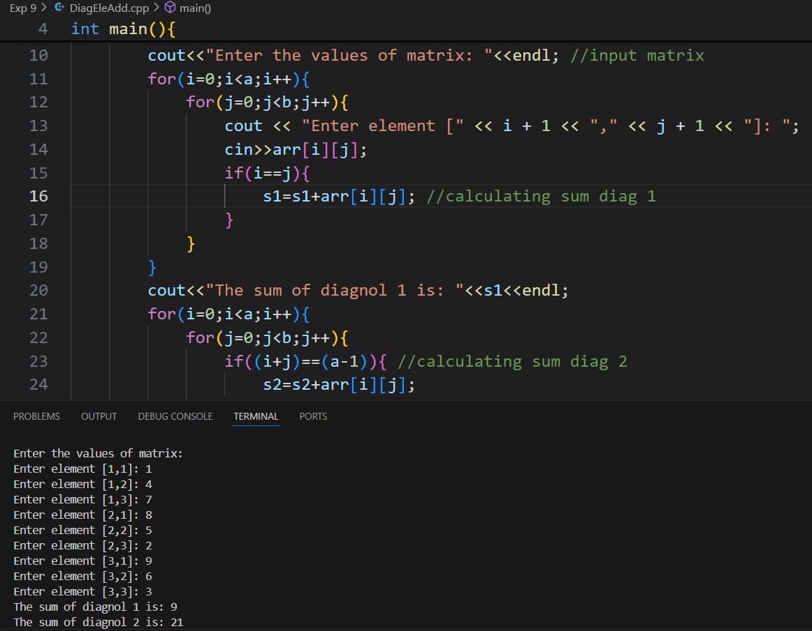
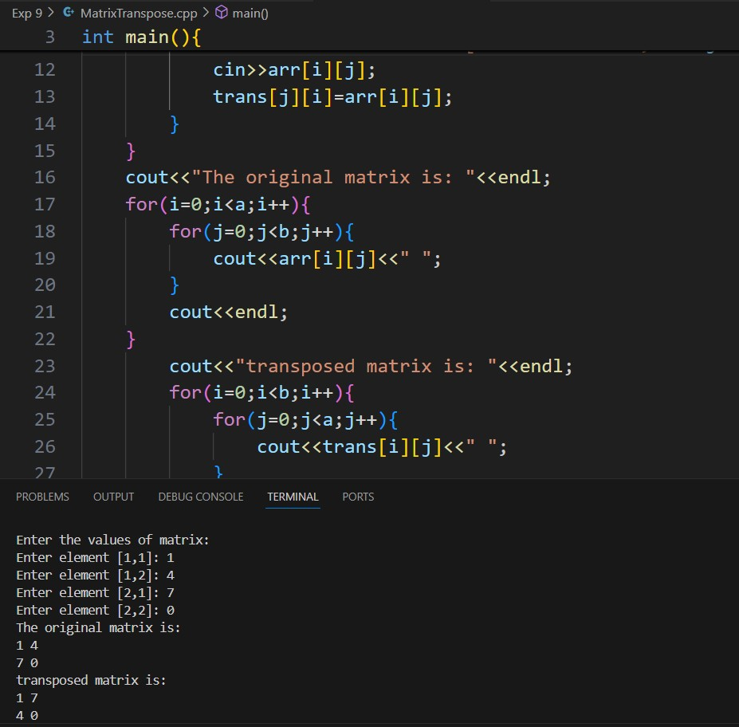

# Experiment 9
## Program 1
### Aim: 
Take number of rows, columns and elements from user and display it in the form of matrix.
### Software used: 
Visual Studio Code
### Theory:
A 2D array in C++ is an array of arrays, where each element is itself an array. This structure is commonly used to represent matrices, grids, or tables. In a 2D array, elements are accessed using two indices: one for the row and one for the column. Matrices are widely used in mathematics, physics, computer graphics, and other fields where data is organized in rows and columns.
### Output:

### Conclusion:
We learned how to input and output multidimensional array.  

## Program 2
### Aim: 
Take two matrices from user and perform addition and multiplication. 
### Software used: 
Visual Studio Code
### Theory:
Addition of Matrices: Matrix addition involves adding corresponding elements of two matrices to produce a new matrix. Both matrices must have the same dimensions for the operation to be valid.
Multiplication of Matrices: Matrix multiplication involves multiplying the rows of the first matrix by the columns of the second matrix. The number of columns in the first matrix must match the number of rows in the second matrix. The resulting matrix's dimensions are determined by the number of rows in the first matrix and the number of columns in the second matrix.
### Output:

### Conclusion:
We learned how to perform matrix addition and multiplication in C++. 

## Program 3
### Aim: 
Take matrix elements from user and perform addition of diagonal elements. 
### Software used: 
Visual Studio Code
### Theory:
In a square matrix, the diagonal elements are those that lie on the line extending from the top-left corner to the bottom-right corner. Adding the diagonal elements involves summing the values of these elements. This operation is often used in linear algebra and matrix analysis, where diagonal elements can represent important characteristics of the matrix.
### Output:

### Conclusion:
We learned how to perform diagonal elements addition of matrix. 

## Program 4
### Aim: 
Take matrix elements from user and perform transpose operation on the matrix. 
### Software used: 
Visual Studio Code
### Theory:
The transpose of a matrix is obtained by swapping its rows with its columns. Specifically, the element at position (i, j) in the original matrix becomes the element at position (j, i) in the transposed matrix. Transposing a matrix is a common operation in linear algebra, and it is used in various applications, such as solving systems of linear equations and transforming geometric data in computer graphics.
### Output:

### Conclusion:
We printed the transpose of a matrix. 
